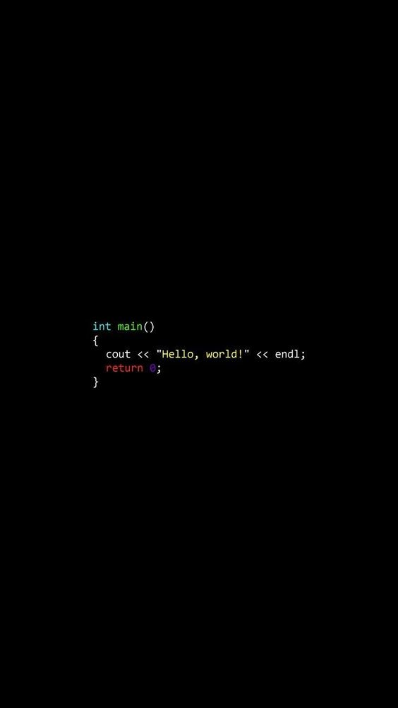

<h1 align="center"> Letícia Awawdeh</h1>

<h2> {Sobre Mim/ About Me} </h2>
    - Estudante de **Engenharia de Software** na **Universidade Federal de Lavras**
    - **Aprendendo** novas linguagens

<h2>Skills</h2>

   - <h4> Linguagens / Languages</h4>
        
   -<h5> Apredendo / Learning </h5>

      

   

